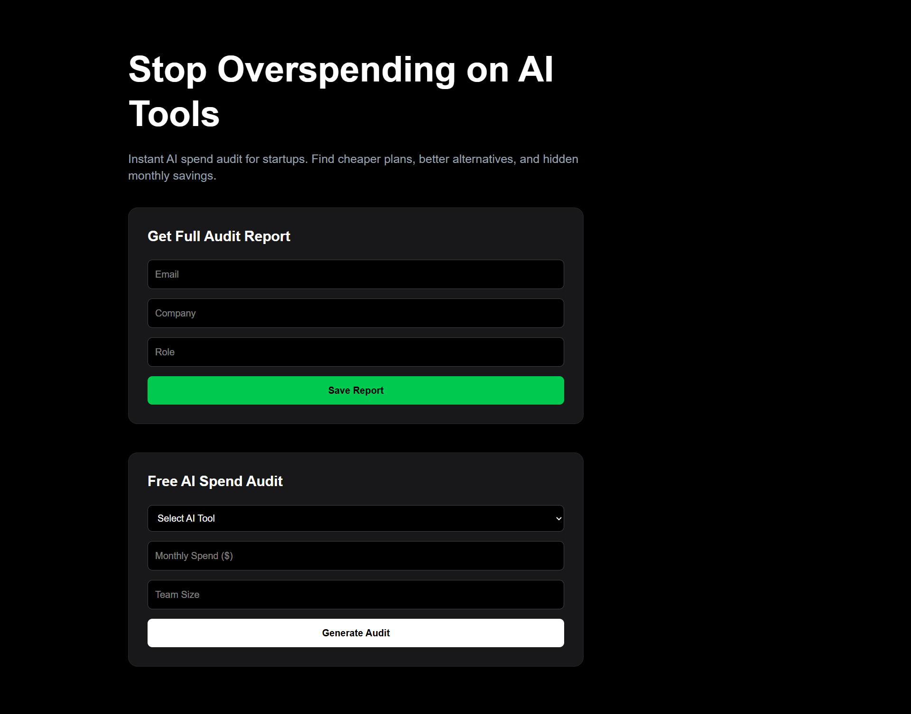
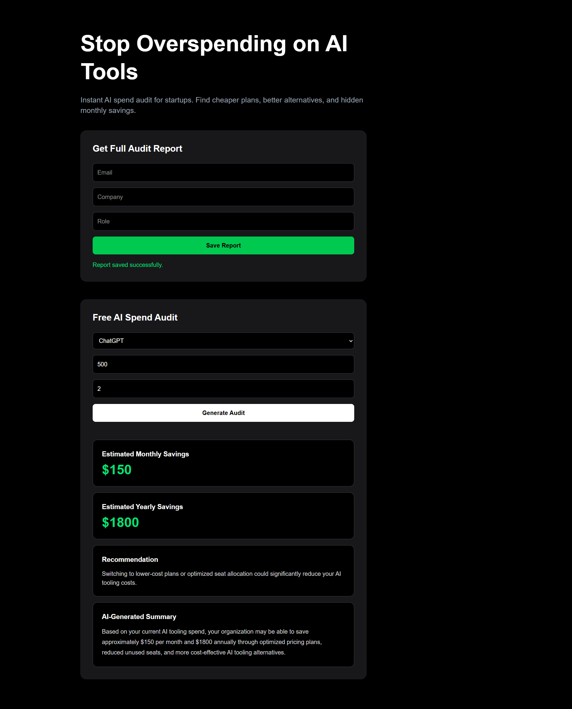
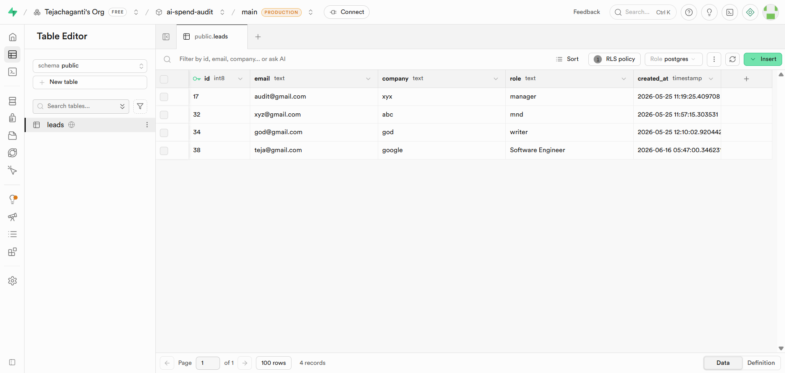

# AI Spend Audit

AI Spend Audit is a full-stack SaaS application that helps startups and engineering teams identify unnecessary spending on AI tools such as ChatGPT, Claude, Cursor, GitHub Copilot, and Gemini.

The platform analyzes AI tool usage, monthly spend, and team size to estimate potential savings, generate optimization recommendations, and capture leads for follow-up reports.

## Live Demo

🔗 https://ai-spend-audit-iota-five.vercel.app

## GitHub Repository

🔗 https://github.com/Tejachaganti/ai-spend-audit

## Features

* AI spend analysis and optimization recommendations
* Monthly savings estimation
* Yearly savings estimation
* AI-generated audit summaries
* Lead capture and report requests
* Supabase database integration
* Responsive user interface
* Automated unit testing

## Tech Stack

### Frontend

* Next.js 16
* React
* TypeScript
* Tailwind CSS

### Backend

* Supabase
* PostgreSQL

### Deployment & Testing

* Vercel
* Vitest

## Project Architecture

### Frontend

* Next.js App Router
* React Components
* Tailwind CSS

### Backend

* Supabase Database
* Lead Storage API

### Core Modules

* Audit Engine
* Pricing Data Layer
* AI Summary Generator

## Local Development

Install dependencies:

```bash
npm install
```

Start development server:

```bash
npm run dev
```

Run tests:

```bash
npx vitest
```

Open:

```text
http://localhost:3000
```

## Deployment

The application is deployed on Vercel and connected to Supabase for persistent data storage.

## Screenshots

### Landing Page

The main interface where users can enter their information and access the AI spend audit tool.



### Audit Results

Example audit showing estimated monthly savings, yearly savings, recommendations, and AI-generated optimization insights.



### Supabase Database Integration

Submitted reports are stored in Supabase, demonstrating a working backend and lead capture workflow.



## Future Improvements

* Advanced AI cost modeling
* API usage-based audits
* Organization-level reporting
* Downloadable audit reports
* Industry benchmark comparisons

## License

Built as part of the Credex Web Development Internship Assignment.
